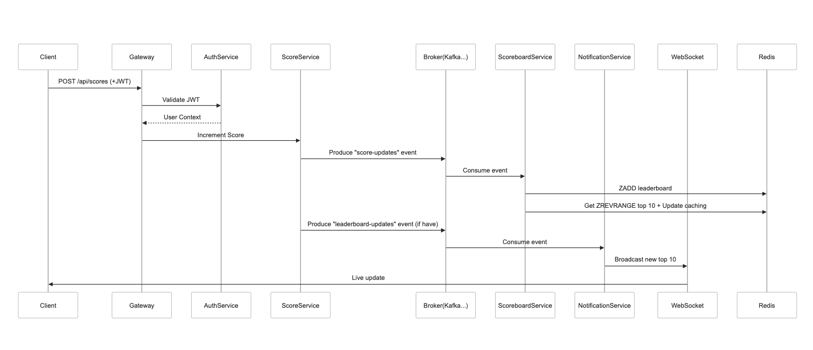

# Live Scoreboard System

NestJS app event driven architech backend system for real-time score updates and leaderboard management.

## Overview
This module handles score increments and live scoreboard updates using Kafka (or alternative broker) for event streaming. Built with NestJS microservices architecture.

## Architecture


**Key Components:**
1. **API Gateway**  
   - REST endpoint for score updates (`POST /api/scores`)
   - JWT validation
   - Request routing

2. **Authentication Service**  
   - Token validation middleware
   - User authorization checks (user context, RBAC, ...)

3. **Score Service**  
   - Score increment logic, need to care about asynchonous APIs (request processing ordered)
   - Kafka event producer (`score-updates` topic)
   - Rate limiting if have (5 requests/s/user)

4. **Scoreboard Service**  
   - Kafka consumer (`score-updates`)
   - Redis-backed leaderboard
   - Kafka event producer (`leaderboard_updated` topic)
   
5. **Notification Service**
   - Kafka consumer (`leaderboard_updated`)
   - WebSocket server

## API Specification

### Update Score
```endpoint
POST /api/scores
Headers:
  Authorization: Bearer {JWT_TOKEN}
  
Request Body:
{
  "score_increment": 10 (number, required)
}
```

### Event Flow
1. Client → Gateway: POST /api/scores
2. Gateway → Auth Service: Validate JWT
3. Auth Service: Return user context
4. Score Service:
    4.1 Save score:
    ``` typescript
    async incrementScore(userId: string, increment: number) {}
    ```
    4.2 Produce Kafka event (`score-updates` topic):
    ``` json
    {
      "user_id": "uuid",
      "new_score": 150,
      "timestamp": "2025-03-01T12:34:00Z"
    }
    ```

5. Scoreboard Service: 
    5.1 Consume event
    5.1 Update top 10
    5.3 Produce Kafka event (`leaderboard_updated` topic):
    ``` json
    {
      "event_type": "leaderboard_updated",
      "top_10": [
        {"user_id": "userid3", "score": 600},
        {"user_id": "userid1", "score": 570}
      ],
      "timestamp": "2025-03-01T12:34:00Z"
    }
    ```
    5.4 Caching top 10

6. Notification Service:
    6.1 Consume event
    6.2 WS broadcast or HTTP streaming

## Additional Improvements
1. Produce/consume event need to prevent duplicate
2. Reduce the number of event send to the Kafka by debound event
3. Consider way to realtime between WebSocket or HTTP streaming,... if clients don’t need bidirectional communication 
4. Add request fingerprint for bot detection
5. Implement consumer region/group scaling for Kafka
6. Store active session WebSocket connections in Redis for scaling
7. Add Prometheus metrics endpoint (endpoint latency, error rates, ...)
8. Rollback for fraud detection
